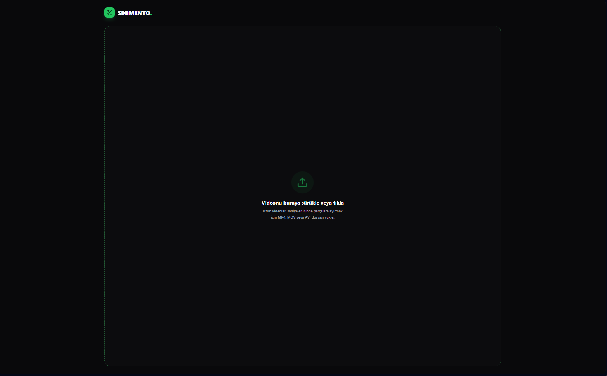
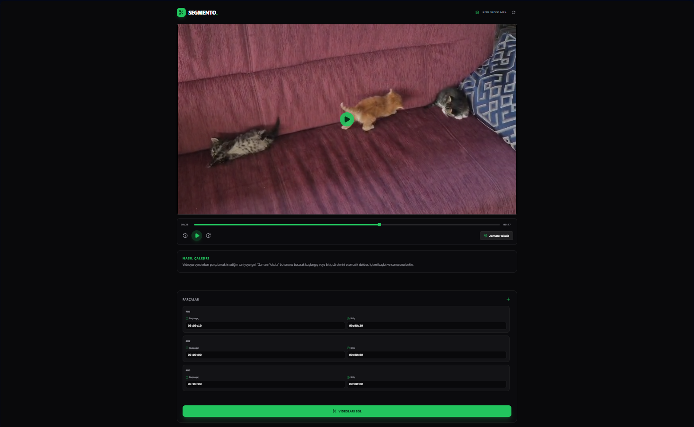
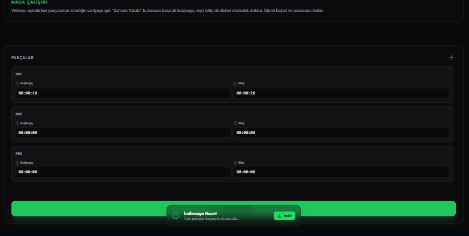
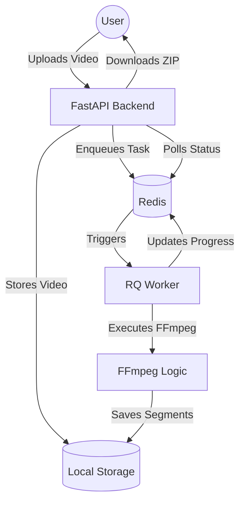

# Segmento - High-Performance Video Splitter


Segmento is a modern, high-performance web application designed for splitting long videos into multiple segments with precision. Built with a professional background processing architecture, it handles heavy video tasks seamlessly without blocking the user interface.

## 📸 Screenshots

| Feature | Preview |
|---------|---------|
| **Dashboard** |  |
| **Video Editor** |  |
| **Download Flow** |  |

## 🚀 Features

- **Instant Splitting:** Uses FFmpeg's stream copying (`-c copy`) for near-instant, lossless video splitting.
- **Visual Preview:** Mark start and end points directly on a video player.
- **Background Processing:** Powered by Python RQ and Redis to handle tasks asynchronously.
- **Progress Tracking:** Real-time polling for task status and progress bars.
- **Batch Download:** Automatically zips multiple segments into a single file for easy downloading.

## 🛠️ Tech Stack

- **Frontend:** React, TypeScript, Vite, Tailwind CSS, shadcn/ui
- **Backend:** Python, FastAPI, RQ (Redis Queue)
- **Video Logic:** FFmpeg
- **Infrastructure:** Docker (for Redis)

## 🏗️ Architecture



## ⚙️ Setup & Installation

### 1. Prerequisites
- **Python 3.9+**
- **Node.js 18+**
- **Docker** (for Redis)
- **FFmpeg** (Must be installed and added to your system PATH)

### 2. Backend Setup
```bash
cd backend
python -m venv venv
source venv/bin/activate  # Windows: venv\Scripts\activate
pip install -r requirements.txt
```

### 3. Frontend Setup
```bash
cd frontend
npm install
```

### 4. Infrastructure
Start Redis using Docker Compose:
```bash
docker-compose up -d
```

## 🏃 Running the Application

1. **Start the API Server:**
   ```bash
   cd backend
   python main.py
   ```

2. **Start the Background Worker:**
   ```bash
   cd backend
   python worker.py
   ```

3. **Start the Frontend:**
   ```bash
   cd frontend
   npm run dev
   ```

Open your browser at `http://localhost:5173`.

## 📜 License
MIT
